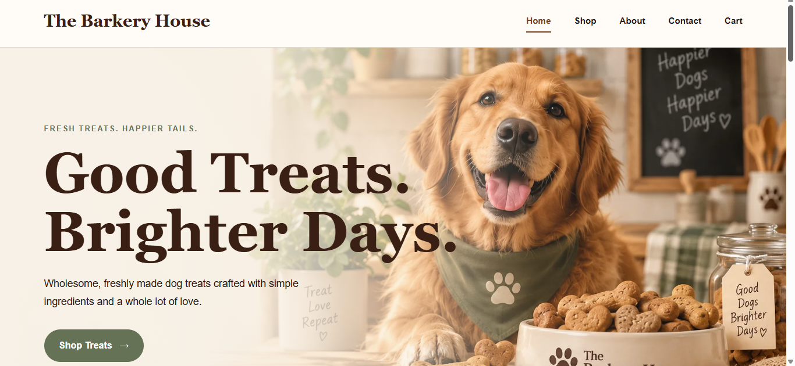
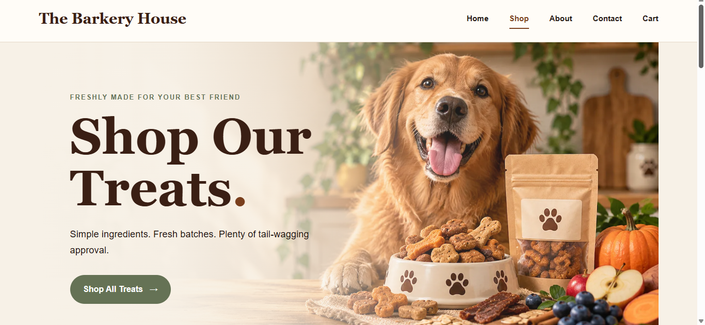
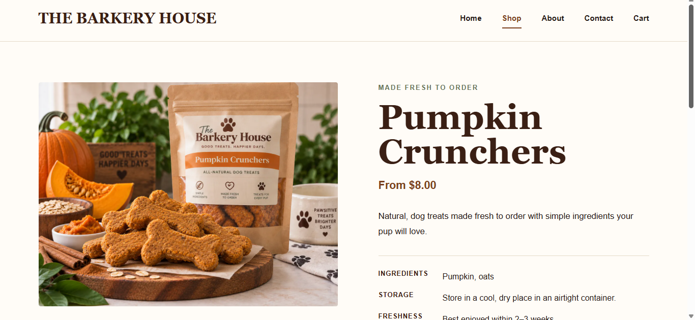
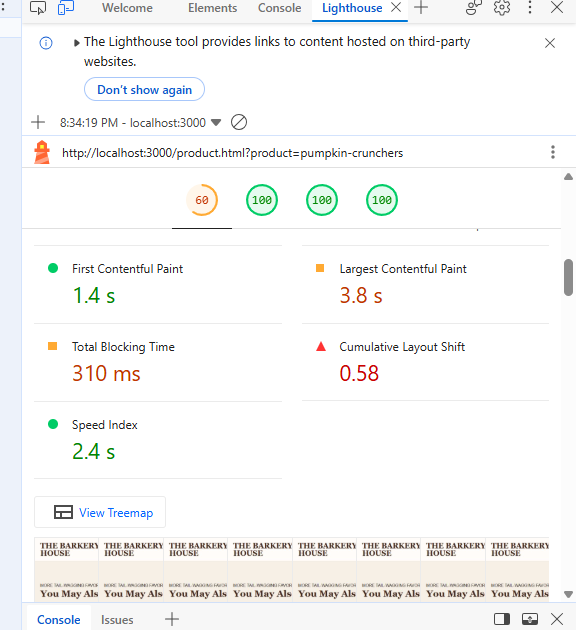
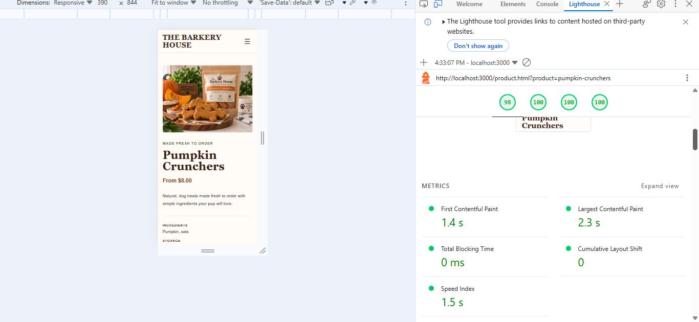

# 🐶 The Barkery House

The Barkery House is a full-stack ecommerce website for a fictional dog treat bakery, designed and developed by **JeLaya Williamson**.

The project was built from scratch using HTML, CSS, JavaScript, Node.js, and Express, with Supabase for database management, Stripe Checkout for secure test payments, and Resend for transactional order and shipping emails.

The store supports a complete ecommerce customer journey, including dynamic product pages, product variants, cart management, coupon discounts, server-side pricing, guest checkout, payment processing, order confirmation, and post-purchase fulfillment.

## 📸 Storefront Preview

### Home



### Shop



### Product



## ✨ Key Features

- Responsive custom storefront built with HTML, CSS, and JavaScript
- Dynamic products and product variants loaded from Supabase
- Product size and quantity selection
- Persistent shopping cart
- Add, update, and remove cart items
- Coupon validation and discount calculations
- Free-shipping threshold calculations
- Server-side checkout pricing
- Guest checkout with no account required
- Stripe Checkout payment integration
- Verified Stripe webhook handling
- Pending order creation and payment lifecycle management
- Order items and shipping addresses stored in the database
- Order confirmation emails
- Order fulfillment workflow from `pending` → `paid` → `processing` → `shipped`
- Carrier, tracking number, and shipment timestamp storage
- Shipping confirmation emails
- Responsive mobile and desktop layouts
- Accessibility and performance optimization

## 🛠️ Tech Stack

### Frontend

- HTML5
- CSS3
- Vanilla JavaScript
- Responsive CSS Grid and Flexbox
- Fetch API for communication with the backend

### Backend

- Node.js
- Express.js
- REST API routes
- Server-side pricing and checkout validation

### Database

- Supabase
- Relational data for products, product variants, carts, cart items, coupons, orders, and order items
- Order status and fulfillment tracking

### Payments

- Stripe Checkout
- Stripe webhook signature verification
- Payment and checkout-session tracking
- Server-side order/payment reconciliation

### Email

- Resend
- Dynamic order confirmation emails
- Shipping confirmation emails with carrier and tracking information

## 🏗️ Application Architecture

The Barkery House uses a custom frontend connected to an Express backend through REST API endpoints. Product, cart, coupon, and order data are stored in Supabase rather than being hard-coded into the storefront.

Checkout calculations are performed on the server so product prices, discounts, shipping, and order totals are not trusted from browser-submitted values. The server creates a pending order before redirecting the customer to Stripe Checkout.

After payment, Stripe sends a signed webhook event to the backend. The webhook verifies the event, reconciles it with the corresponding Barkery House order, updates the order to paid, converts the associated cart, and triggers the order confirmation email.

Orders can then move through the fulfillment lifecycle:

`pending` → `paid` → `processing` → `shipped`

When an order is shipped, the application stores the carrier, tracking number, and shipment timestamp and sends a shipping confirmation email.

## 🛒 Ecommerce Functionality

### Products & Variants

Products are loaded dynamically from the backend and can include multiple active variants with individual sizes and prices. Product detail pages use URL slugs to determine which product should be displayed.

### Shopping Cart

The cart supports:

- Persistent guest carts
- Product variants
- Quantity updates
- Individual item removal
- Dynamic subtotal calculations
- Coupon application and removal
- Shipping calculations
- Estimated order totals

### Coupons & Pricing

Coupon codes are validated through the backend rather than relying solely on frontend calculations.

The checkout process recalculates pricing server-side, including:

- Product prices
- Quantities
- Subtotal
- Coupon discounts
- Discounted subtotal
- Shipping
- Final order total

This prevents browser-submitted pricing from being treated as the source of truth.

### Orders & Fulfillment

The order system supports the following lifecycle:

`pending` → `paid` → `processing` → `shipped`

Order records can include:

- Stripe Checkout session ID
- Associated cart
- Purchased items
- Shipping address
- Coupon information
- Order status
- Carrier
- Tracking number
- Shipment timestamp

Stripe webhook handling also includes protection against processing the same completed checkout more than once.

## 🧪 Testing & Quality Assurance

The Barkery House was tested through complete customer and fulfillment workflows, including:

- Home-to-product navigation
- Product variant and quantity selection
- Cart creation and persistence
- Quantity updates and item removal
- Valid and invalid coupon handling
- Shipping and total calculations
- Empty-cart protection
- Cart-to-checkout pricing consistency
- Stripe test checkout
- Payment verification
- Order confirmation
- Transactional email delivery
- Paid-to-processing order updates
- Processing-to-shipped fulfillment
- Carrier and tracking storage
- Responsive mobile and desktop layouts
- Browser console error checks
- Lighthouse performance, accessibility, best practices, and SEO audits

Performance optimization reduced layout shift on the dynamic product page from a CLS score of **0.580 to 0**, while improving its Lighthouse Performance score from **60 to 98**.

## ⚡ Performance Optimization

The dynamic product page underwent a focused performance optimization pass after Lighthouse testing identified significant layout instability and rendering delays.

### Before Optimization

- Lighthouse Performance: **60**
- Cumulative Layout Shift (CLS): **0.580**
- Largest Contentful Paint (LCP): **3.0s**
- Total Blocking Time: **310ms**



### After Optimization

- Lighthouse Performance: **98**
- Cumulative Layout Shift (CLS): **0**
- Largest Contentful Paint (LCP): **2.3s**
- Total Blocking Time: **0ms**



The optimization work included identifying layout-shift sources, stabilizing dynamically loaded product content, improving image behavior, and preventing related-product content from shifting the page after initial render.

## 🚀 Installation & Setup

### Prerequisites

Before running the project locally, install:

- Node.js
- npm
- Stripe CLI for local webhook testing
- A Supabase project
- A Stripe account
- A Resend account

### 1. Install Dependencies

From the project root, install the required Node.js packages:

```bash
npm install
```

### 2. Configure Environment Variables

Create a `.env` file in the project root using `.env.example` as a reference.

Required environment variables:

```env
PORT=3000

SUPABASE_URL=
SUPABASE_SECRET_KEY=

STRIPE_SECRET_KEY=
STRIPE_WEBHOOK_SECRET=

RESEND_API_KEY=
```

Never commit the real `.env` file or private API credentials to source control.

### 3. Start the Application

Start the Express server:

```bash
npm start
```

The application runs locally at:

```text
http://localhost:3000
```
### 4. Stripe Webhook Testing

For local Stripe payment and webhook testing, start the Stripe CLI and forward events to the application's webhook endpoint:

```bash
stripe listen --forward-to localhost:3000/api/webhook
```

Copy the webhook signing secret provided by the Stripe CLI into:

```env
STRIPE_WEBHOOK_SECRET=
```

Restart the server after changing environment variables.

### Windows PowerShell Note

On Windows systems where PowerShell execution policy prevents `npm.ps1` or `stripe.ps1` from running, the corresponding `.cmd` executable can be used instead.

For example:

```powershell
npm.cmd start
```

The application itself does not require changing the system-wide PowerShell execution policy.

## 🔐 Security

Sensitive credentials and environment variables are stored outside the source code using a local `.env` file.

The repository includes `.env.example` to document the required environment variables without exposing private credentials.

Checkout pricing is recalculated on the server, and Stripe webhook signatures are verified before payment events are processed.

## 🌱 Future Improvements

Potential future additions include:

- Optional customer accounts
- Saved customer information
- Order history
- Loyalty and rewards features
- Customer-facing order and shipping status tracking
- Administrative order management tools

The current version intentionally uses guest checkout so customers can complete purchases without creating an account.

## 👩🏽‍💻 Developer

**JeLaya Williamson**

The Barkery House was created as a full-stack web development portfolio project demonstrating custom frontend development, relational data management, REST APIs, ecommerce logic, payment processing, webhook handling, transactional email, order fulfillment, responsive design, accessibility, performance optimization, and end-to-end testing.

---

*The Barkery House is a fictional brand created for portfolio and educational purposes.*